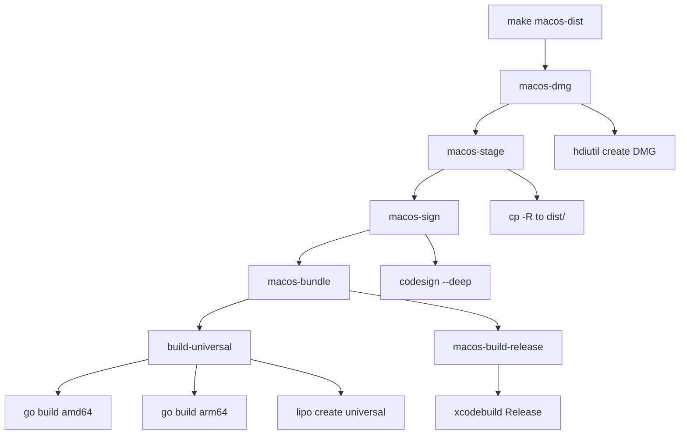

# macOS Team Distribution Plan

## Goal

Ship a self-contained `SlackStatusApp.dmg` that teammates can download, drag to Applications, and run — with the Go CLI binary bundled inside the `.app` at `Contents/Resources/slack-status`, requiring zero separate CLI installation.

---

## Current State Analysis

### What exists today

| Aspect | Current behavior |
|--------|-----------------|
| CLI build | `make build` produces `./slack-status` via `go build` with ldflags |
| CLI install | `make install` copies to `/usr/local/bin/slack-status` with sudo |
| macOS build | `make macos-build` runs `xcodebuild` into `macos/build/` |
| CLI discovery | [`resolveExecutablePath()`](macos/SlackStatusApp/CLIService.swift:81) probes `/usr/local/bin`, `/opt/homebrew/bin`, then `Bundle.main.bundleURL/Contents/Resources/slack-status` |
| Bundle resource copy | **None** — no build phase or Makefile step copies the Go binary into the `.app` bundle |
| Code signing | [`project.pbxproj`](macos/SlackStatusApp.xcodeproj/project.pbxproj:143) sets `CODE_SIGN_STYLE = Automatic` in both Debug and Release — this means Xcode ad-hoc signs during local builds but produces no distributable identity |
| DMG packaging | Does not exist |
| Build configuration | `MACOS_CONFIGURATION` defaults to `Debug`; no Release-oriented distribution workflow |

### Key gap

[`resolveExecutablePath()`](macos/SlackStatusApp/CLIService.swift:81) already has the bundled-helper fallback at line 85-87, but nothing in the build pipeline actually places the binary there. A teammate who receives the `.app` without a system-installed CLI will hit [`BackendError.binaryNotFound`](macos/SlackStatusApp/CLIService.swift:94).

---

## Self-Signing Feasibility Analysis

### Can you self-sign without an Apple Developer account?

**Yes.** macOS provides two mechanisms that do not require a paid Apple Developer Program membership:

1. **Ad-hoc signing** (`codesign -s -`): Signs the binary with no identity. The signature proves internal integrity but is not traceable to any certificate. This is what Xcode does during local Debug builds with `CODE_SIGN_STYLE = Automatic` when no Developer ID is configured.

2. **Local self-signed certificate**: You can create a self-signed code-signing certificate in Keychain Access and sign with it. This adds a named identity but macOS still treats it as untrusted for Gatekeeper purposes.

### User experience comparison

| Distribution method | First launch UX | Subsequent launches | Gatekeeper quarantine | Notes |
|---|---|---|---|---|
| **Unsigned** (no codesign at all) | macOS refuses to open; user must right-click → Open, or `xattr -cr` the app | Normal after first override | Full quarantine flag | Worst UX; some corporate MDM policies block this entirely |
| **Ad-hoc signed** (`codesign -s -`) | Same Gatekeeper warning as unsigned; user must right-click → Open or `xattr -cr` | Normal after first override | Full quarantine flag | Identical end-user UX to unsigned, but the binary passes `codesign --verify` which some tools check |
| **Self-signed certificate** | Same Gatekeeper warning | Normal after first override | Full quarantine flag | No practical UX improvement over ad-hoc for recipients |
| **Developer ID signed + notarized** | Seamless double-click launch | Normal | No quarantine | Requires paid Apple Developer Program ($99/year) |

### Recommendation

**Use ad-hoc signing (`codesign -s -`).** It is free, requires no certificate management, produces a structurally valid signed bundle, and the end-user experience is identical to any other non-notarized distribution. The Makefile target should make signing optional so a Developer ID can be substituted later without changing the workflow.

### Teammate onboarding instruction

Recipients of the DMG will need to do one of:

- Right-click the app → Open → click Open in the dialog (one-time)
- Or run `xattr -cr /Applications/SlackStatusApp.app` after dragging to Applications

This is standard for internal/team macOS tools without notarization.

---

## Implementation Plan

### 1. Build the Go CLI as a universal binary for bundling

The Go CLI must be compiled for the same architecture as the recipient machine. Since the team may have both Intel and Apple Silicon Macs, build a universal (fat) binary.

**Changes to [`Makefile`](Makefile):**

Add a new target `build-universal` that produces a fat binary:

```makefile
CLI_UNIVERSAL := slack-status-universal

build-universal:
	GOOS=darwin GOARCH=amd64 go build -ldflags "$(LDFLAGS)" -o $(BINARY)-amd64
	GOOS=darwin GOARCH=arm64 go build -ldflags "$(LDFLAGS)" -o $(BINARY)-arm64
	lipo -create -output $(CLI_UNIVERSAL) $(BINARY)-amd64 $(BINARY)-arm64
	rm -f $(BINARY)-amd64 $(BINARY)-arm64
```

### 2. Copy the CLI binary into the .app bundle after xcodebuild

After `xcodebuild` produces the `.app`, copy the pre-built Go binary into `Contents/Resources/`.

**New Makefile target `macos-bundle`:**

```makefile
macos-bundle: build-universal macos-build-release
	cp $(CLI_UNIVERSAL) "$(MACOS_APP)/Contents/Resources/slack-status"
	chmod 755 "$(MACOS_APP)/Contents/Resources/slack-status"
```

This is done as a post-build Makefile step rather than an Xcode build phase because:
- The Go binary is built outside Xcode's build system
- It avoids modifying [`project.pbxproj`](macos/SlackStatusApp.xcodeproj/project.pbxproj) with a shell script phase that would need to know the repo root path
- It keeps the Xcode project clean for developers who open it directly

### 3. Add a Release-configuration xcodebuild target

The current `macos-build` defaults to Debug. Distribution builds should use Release.

```makefile
macos-build-release:
	xcodebuild -project $(MACOS_PROJECT) -scheme $(MACOS_SCHEME) \
		-configuration Release -derivedDataPath $(MACOS_DERIVED_DATA) build
```

The existing `MACOS_APP` variable already respects `$(MACOS_CONFIGURATION)`, so for the distribution pipeline we override it:

```makefile
MACOS_DIST_APP := $(MACOS_DERIVED_DATA)/Build/Products/Release/$(MACOS_SCHEME).app
```

### 4. Ad-hoc code signing target

```makefile
CODESIGN_IDENTITY ?= -

macos-sign: macos-bundle
	codesign --force --deep --sign "$(CODESIGN_IDENTITY)" "$(MACOS_DIST_APP)"
	codesign --verify --verbose "$(MACOS_DIST_APP)"
```

- `CODESIGN_IDENTITY ?= -` defaults to ad-hoc but allows `make macos-sign CODESIGN_IDENTITY="Developer ID Application: ..."` if someone later has a paid identity.
- `--deep` signs the embedded CLI helper binary as well.
- `--force` re-signs even if Xcode already ad-hoc signed during build.

### 5. Stage a clean distributable .app

Copy the built `.app` to a staging directory so the DMG source is isolated from derived data:

```makefile
MACOS_DIST_DIR := dist

macos-stage: macos-sign
	rm -rf $(MACOS_DIST_DIR)
	mkdir -p $(MACOS_DIST_DIR)
	cp -R "$(MACOS_DIST_APP)" "$(MACOS_DIST_DIR)/"
```

### 6. Package into a DMG

Use `hdiutil` which ships with macOS — no third-party tools needed:

```makefile
DMG_NAME := SlackStatusApp.dmg

macos-dmg: macos-stage
	rm -f $(DMG_NAME)
	hdiutil create -volname "SlackStatusApp" \
		-srcfolder $(MACOS_DIST_DIR) \
		-ov -format UDZO \
		$(DMG_NAME)
	@echo ""
	@echo "Distribution DMG created: $(DMG_NAME)"
	@echo "Recipients: right-click the app → Open on first launch."
	@echo ""
```

### 7. Top-level convenience target

```makefile
macos-dist: macos-dmg
```

This is the single command a developer runs to produce a distributable DMG:

```
make macos-dist
```

### 8. Clean target update

Extend the existing clean behavior (or add one) to remove distribution artifacts:

```makefile
macos-clean:
	rm -rf $(MACOS_DERIVED_DATA) $(MACOS_DIST_DIR) $(DMG_NAME) $(CLI_UNIVERSAL)
```

---

## Required Code and Project Changes

### A. No changes needed to CLIService.swift

[`resolveExecutablePath()`](macos/SlackStatusApp/CLIService.swift:81) already probes `Bundle.main.bundleURL/Contents/Resources/slack-status` as the third candidate at lines 85-87. Once the Makefile copies the binary there, it will be discovered automatically. The fallback order is correct: system-installed CLI takes precedence during development, bundled binary is the safety net for distribution.

### B. No changes needed to project.pbxproj

The Xcode project does not need a Copy Files build phase or a shell script phase. The Makefile handles CLI bundling as a post-build step. This keeps the Xcode project simple and avoids coupling it to the Go toolchain.

### C. Makefile changes (summary)

All changes are in [`Makefile`](Makefile). New variables and targets:

| Addition | Purpose |
|----------|---------|
| `CLI_UNIVERSAL` variable | Path for the universal fat binary |
| `MACOS_DIST_APP` variable | Release-configuration `.app` path |
| `MACOS_DIST_DIR` variable | Staging directory for clean distribution |
| `DMG_NAME` variable | Output DMG filename |
| `CODESIGN_IDENTITY` variable | Defaults to `-` for ad-hoc; overridable |
| `build-universal` target | Builds fat amd64+arm64 Go binary |
| `macos-build-release` target | Runs xcodebuild with Release configuration |
| `macos-bundle` target | Copies CLI into `.app/Contents/Resources/` |
| `macos-sign` target | Ad-hoc codesigns the bundle |
| `macos-stage` target | Copies `.app` to clean `dist/` directory |
| `macos-dmg` target | Creates DMG from staged directory |
| `macos-dist` target | Top-level convenience: runs the full pipeline |
| `macos-clean` target | Removes all build and distribution artifacts |

### D. .gitignore update

Add these entries to [`.gitignore`](.gitignore):

```
dist/
*.dmg
slack-status-universal
```

### E. Update help target

Add the new targets to the [`help`](Makefile:17) output.

### F. Update macos/README.md

Document the distribution workflow and first-launch instructions for recipients.

---

## Target Dependency Chain



Full pipeline sequence when running `make macos-dist`:

1. `build-universal` — cross-compile Go CLI for amd64 and arm64, merge with lipo
2. `macos-build-release` — xcodebuild the Swift app in Release configuration
3. `macos-bundle` — copy universal CLI binary into `.app/Contents/Resources/slack-status`
4. `macos-sign` — ad-hoc codesign the entire `.app` bundle including the embedded helper
5. `macos-stage` — copy the signed `.app` to a clean `dist/` directory
6. `macos-dmg` — package `dist/` into `SlackStatusApp.dmg` using hdiutil

---

## What Teammates Receive

1. A single `SlackStatusApp.dmg` file (shared via Slack, Google Drive, etc.)
2. They open the DMG, drag `SlackStatusApp.app` to Applications
3. First launch: right-click → Open → confirm the Gatekeeper dialog (one-time)
4. The app finds the CLI at `Contents/Resources/slack-status` automatically
5. They run `slack-status login` from the app's Login button to set up their OAuth token
6. No Homebrew, no Go toolchain, no `make install` needed

---

## Out of Scope

- Apple Developer Program enrollment and notarization (can be added later by overriding `CODESIGN_IDENTITY` and adding a `notarytool` step)
- Auto-update mechanism
- Sparkle framework integration
- CI/CD pipeline (GitHub Actions, etc.)
- DMG background image or custom window layout (hdiutil UDZO is functional; prettification is cosmetic)

---

## Execution Checklist

- [ ] Add `build-universal` target to Makefile
- [ ] Add `macos-build-release` target to Makefile
- [ ] Add `macos-bundle` target to Makefile that copies CLI into .app/Contents/Resources/
- [ ] Add `macos-sign` target with `CODESIGN_IDENTITY ?= -` defaulting to ad-hoc
- [ ] Add `macos-stage` target to Makefile
- [ ] Add `macos-dmg` target using hdiutil
- [ ] Add `macos-dist` convenience target
- [ ] Add `macos-clean` target
- [ ] Add new variables: CLI_UNIVERSAL, MACOS_DIST_APP, MACOS_DIST_DIR, DMG_NAME, CODESIGN_IDENTITY
- [ ] Update help target with new distribution targets
- [ ] Update .gitignore with dist/, *.dmg, slack-status-universal
- [ ] Update macos/README.md with distribution workflow and first-launch instructions
- [ ] Test full pipeline: `make macos-dist` produces a working DMG
- [ ] Test bundled app launches and discovers CLI at Contents/Resources/slack-status
- [ ] Test on a clean machine without system-installed CLI
